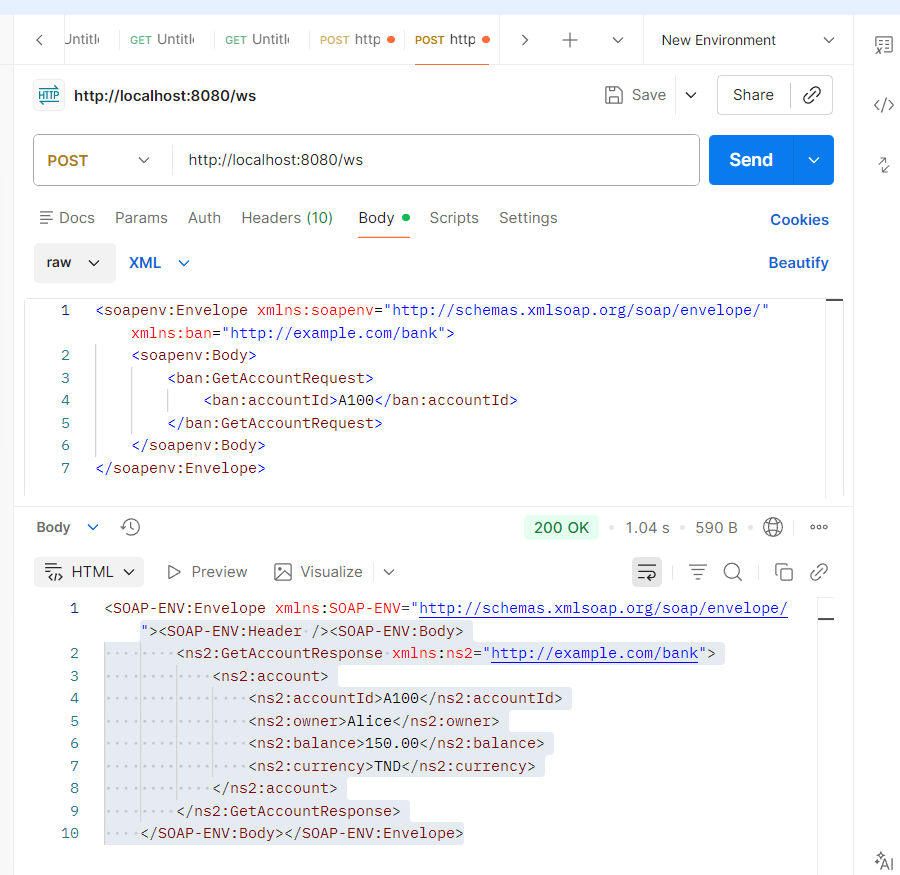
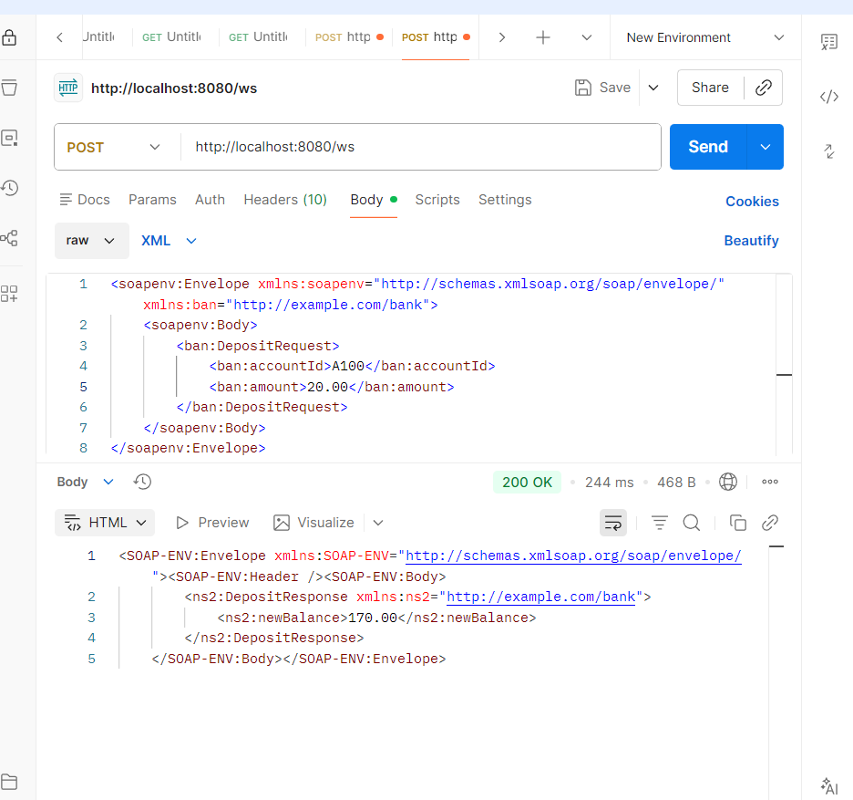
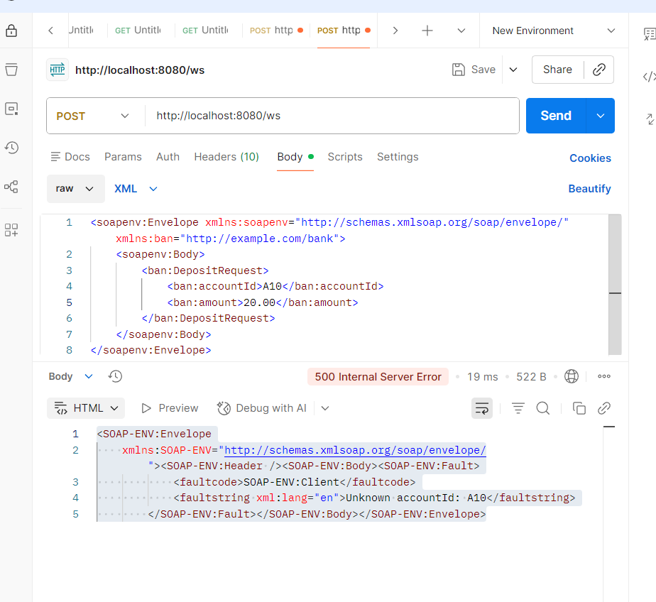
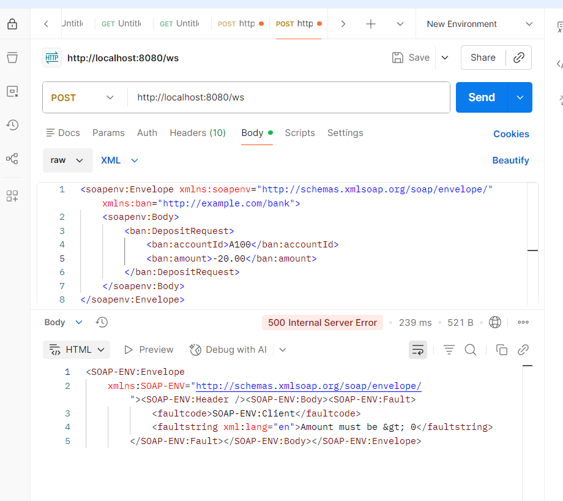
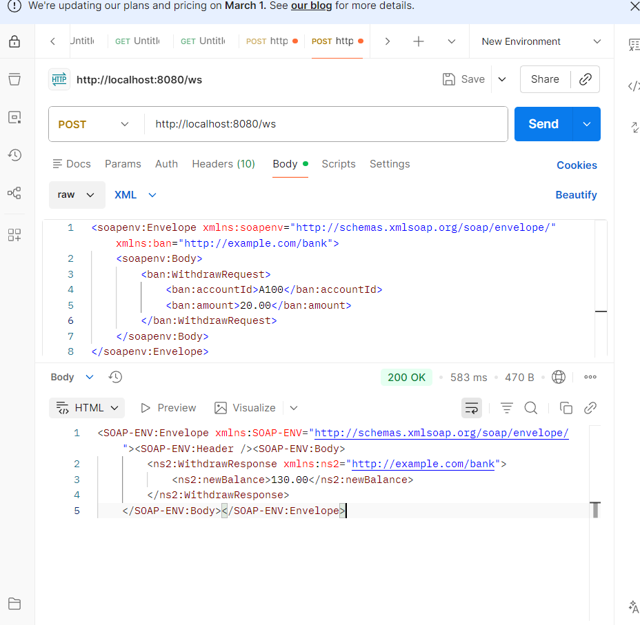
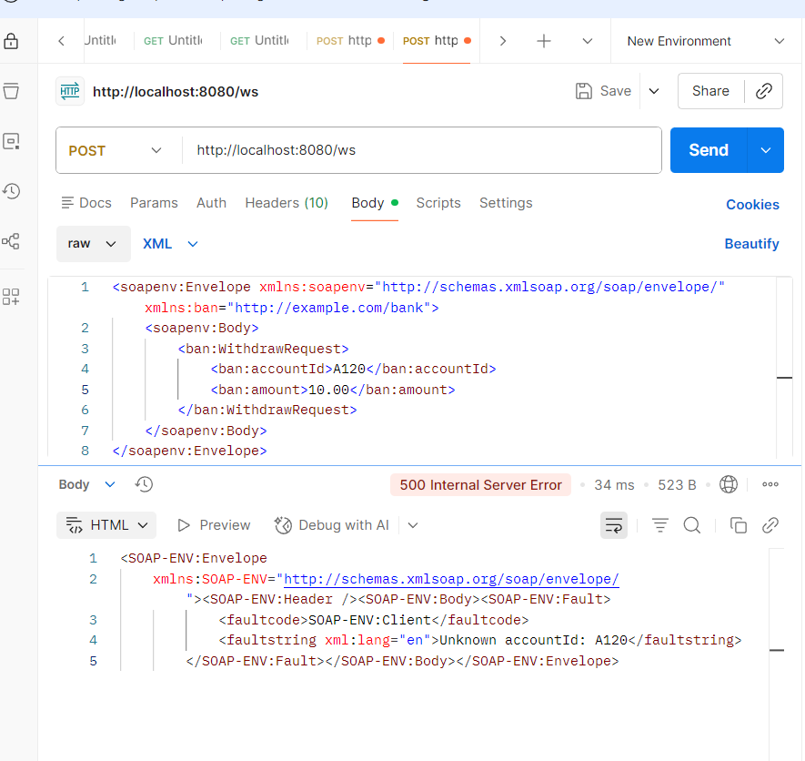
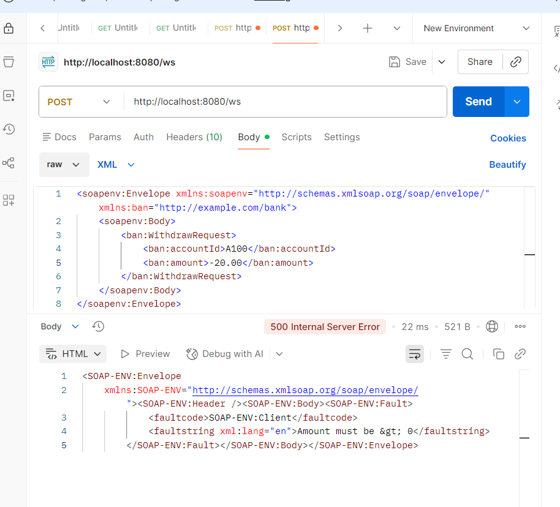
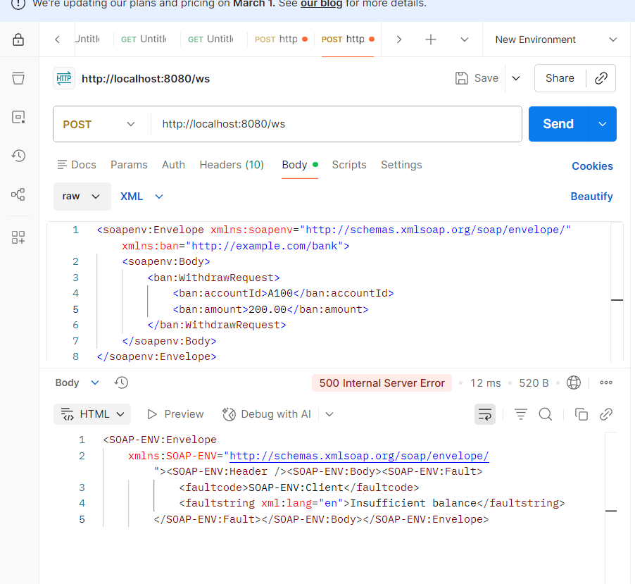

# B- Lecture du Contrat (Analysis)

## 1-définir la structure du message SOAP

définit les types XML, les éléments de requête et réponse pour le service SOAP.

## 2- dans bank.xsd on a :

GetAccountRequest
accountId : string
GetAccountResponse
owner : string
balance : decimal
currency : string

DepositRequest
accountId : string
amount : decimal

DepositResponse
newBalance : decimal

# C- Resultats de tests Postman

## GetAccount

récupération correcte des informations du compte.

## Deposit

### possible fault cases

**unknown account :**

**unvalid amount :**

## Withdraw

### possible fault cases

**unknown account :**

**unvalid amount :**

**insufficient balance :**

# D- Fonctionnalité ajoutée

Withdraw :nouvelle opération permettant de retirer un montant d’un compte existant.
Le service vérifie que :
le compte existe,
le montant est strictement positif,
le solde est suffisant.

# fichiers modifiés :

**bank.xsd :** ajout de WithdrawRequest et WithdrawResponse
**BankService.java :** methode withdraw()
**BankEndpoint.java :**implémentation de la méthode withdraw()
**classes generees jaxb :** WithdrawRequest et WithdrawResponse
